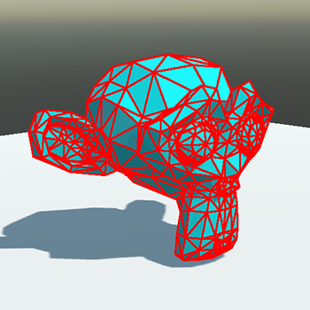

# Mesh Collider

A collider represented by an arbitrary mesh.

A **Mesh Collider** uses the owner entity meshes to define its shape. It uses all `MeshComponent` objects to obtain meshes and creates colliders with them.

## Types of Mesh Collider

### Default mode

By default, a Mesh Collider uses **the entire triangle mesh to generate a collider shape**. This creates the best precision and fidelity. However, only [Static Bodies](../physics_bodies/static_bodies.md) can have Mesh Colliders in the default mode.

Mesh Colliders in the default mode are more suitable for creating collisions for static scenery objects, such as walls, terrain, props, etc.

> [!IMPORTANT]
> Only [Static Bodies](../physics_bodies/static_bodies.md) can have Mesh Colliders in the default mode.

### Convex Hull

If you want to use Mesh Colliders in dynamic bodies like [Rigid Bodies](../physics_bodies/rigid_bodies.md), you need to set your Mesh Collider to use a Convex Hull. In this mode, the physics engine creates a convex approximation of the mesh, allowing it to be used in dynamic bodies. As a trade-off, the precision of the collision is reduced.

Convex colliders are suitable for movable physics objects like chairs, tables, stones, etc.

## MeshCollider3D component

To use a Mesh Collider in Evergine, you only need to add a `MeshCollider3D` component to your entity.

> [!NOTE]
> It is obvious, but to use a `MeshCollider3D`, the owner entity is required to have at least one `MeshComponent`.

### Properties

| Property | Default | Description | 
| --- | --- | --- |
| **Size** | 1,1,1 | This property allows you to scale the generated Mesh Collider. | 
| **Offset** | 0,0,0 | Position offset of the collider relative to the owner entity. The units are relative to the size of the entity mesh. | 
| **RotationOffset** | 0,0,0 | Applies a rotation offset to the Collider relative to the owner entity. | 
| **Margin** | 0.04 | The physics engine uses a small collision margin for collision shapes to improve performance and reliability of the collision detection. | 
| **AsyncShapeCreation** | false | Allows the creation of Mesh Colliders asynchronously. Creating mesh colliders can be very CPU intensive. By default, the execution thread is blocked until the Mesh Collider is generated. If this property is set to `true`, the generation is done on a separate thread, freeing the main thread. However, it is possible that for some frames the collider won't work. | 
