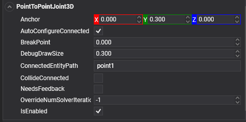

Here is the improved text with grammatical corrections:

# Point-to-Point Joint

<video autoplay loop muted width="100%" height="auto">
  <source src="images/PointToPointJointVideo.mp4" type="video/mp4">
</video>

The **Point-to-Point Joint** limits the translation such that the pivot points between the two rigid bodies match in world space. You can use the Point-to-Point Joint to create effects such as a chain-link or to pin objects together.

## FixedJoint3D

In Evergine, a Point-to-Point Joint is implemented using the `PointToPointJoint3D` component.



## Properties

| Property | Default | Description |
| --- | --- | --- |
| **ConnectedEntityPath** | null |  The [entity path](../../basics/component_arch/entities/entity_hierarchy.md#entity-paths) of the connected body. A joint is established properly only when the path is valid. |
| **Anchor** | 0, 0, 0 | The point that defines the center of the joint in the source entity local space. All physics-based simulations use this point as the center in calculations. |
| **AutoConfigureConnected** | true | Enable this setting to automatically calculate the *ConnectedAnchor's* position to match the global position of the anchor property. This is the default setting. Disable it to configure the position of the connected anchor manually. |
| **ConnectedAnchor** | *auto-calculated* | Manually configure the connected anchor position in the connected body's local space. |
| **BreakPoint** | 0 | If the value is greater than 0, it indicates the force that needs to be applied for this joint to break. |
| **CollideConnected** | false | Determines whether a collision between the two bodies managed by the joint is enabled. |

## Using the Point-to-Point Joint

This snippet creates two bodies and adds a fixed joint, maintaining the relative position from the start. This is because the `AutoConfigureConnected` property is set to true.

<video autoplay loop muted width="400px" height="auto">
  <source src="images/P2PSample.mp4" type="video/mp4">
</video>

```csharp
protected override void CreateScene()
{
    // Load your material
    var cubeMaterial = this.Managers.AssetSceneManager.Load<Material>(EvergineContent.CrateMat);

    int chainLength = 6;
    Entity previousLink = null;

    // Create the chain...
    for (int i = 0; i < chainLength; i++)
    {
        // The first object is kinematic (we don't want a falling chain :D)
        var rigidObjectType = (i == 0) ? RigidBodyType3D.Kinematic : RigidBodyType3D.Dynamic;

        // Create the link entities...
        var link = this.CreateCube(cubeMaterial, new Vector3(i, 0, 0), 0.75f, rigidObjectType);

        if (previousLink != null)
        {
            // Add a PointToPoint joint to the previous link connected to the current link...
            previousLink.AddComponent(new PointToPointJoint3D()
            {
                ConnectedEntityPath = link.EntityPath,
            });
        }

        previousLink = link;

        this.Managers.EntityManager.Add(link);
    }
}

private Entity CreateCube(Material material, Vector3 position, float size, RigidBodyType3D rigidBodyType)
{
    Entity cube = new Entity()
        .AddComponent(new Transform3D()
        {
            Position = position
        })
        .AddComponent(new MaterialComponent() { Material = material })
        .AddComponent(new CubeMesh() { Size = size })
        .AddComponent(new MeshRenderer())

        .AddComponent(new RigidBody3D()  // Add a RigidBody3D component...
        {
            PhysicBodyType = rigidBodyType
        })
        .AddComponent(new BoxCollider3D());  // Add a BoxCollider3D to the physic body...

    return cube;
}
```