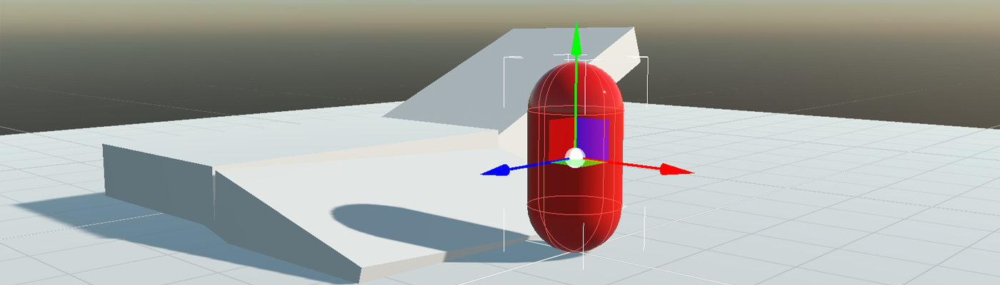

# Character Controller



The character controller is a type of physics body used for player objects to provide collision-based physics while also allowing for more customizations dedicated to game characters (player or NPCs). It's a common choice for first-person and third-person games.


In Evergine, we use the `CharacterController3D` component to provide this functionality.

## CharacterController3D Component


### General Properties

| Property | Default | Description |
| --- | --- | --- |
| **Restitution** | 0 | Sets the amount of kinetic energy lost or gained after a collision. A typical value is between 0 and 1. If the restitution property of colliding bodies is 0, the bodies lose all energy and stop moving immediately on impact. If the restitution is 1, they lose no energy and rebound with the same velocity they collided at. Use this to change the "bounciness" of rigidbodies. |
| **Friction** | 0.5 | Sets the surface friction. |
| **RollingFriction** | 0 | Sets the rolling friction. |
| **IsSensor** | true | Characters are a special type of physics body and by default are created as sensors. |
| **CollisionCategory** | `Cat1` | The CollisionCategory flag specifies the category of this body. |
| **MaskBit** | `All` | The MaskBits indicate with which categories this body will collide. |

### Character Properties

The following properties affect the movement of the rigidbody.

| Property | Default | Description |
| --- | --- | --- |
| **StepHeight** | 0.2 | The maximum height the character can step onto. |
| **FallSpeed** | 55 | Maximum velocity of a character in free fall (m/s). By default, it is 55, the terminal velocity of a sky diver. |
| **JumpSpeed** | 10 | Jump speed. |
| **MaxSlope** | 45 | Limits the character to only climb slopes that are less steep (in degrees) than the indicated value. |
| **Gravity** | 29.4 | 3G gravity acceleration. |

### Useful Methods

To control a character, you may find these methods useful:

| Method | Description |
| --- | --- |
| **SetVelocity(velocity)** | Sets the character velocity. This is the most common way to move and control a character. After setting a velocity vector, the character will move in that direction and will interact with the physics world. |
| **Jump(), Jump(jumpDirection)** | The character performs a jump movement. You can specify an optional jump direction. |
| **Teleport(newPosition)** | Teleports the character to a new position. |

## Create a Character Controller

### From Code

This code is used to create a character body:
```csharp
Entity character = new Entity()
    .AddComponent(new Transform3D() { Position = characterPosition })
    .AddComponent(new MaterialComponent() { Material = material }) // assign a material
    .AddComponent(new CapsuleMesh())
    .AddComponent(new MeshRenderer())
    .AddComponent(new CharacterController())    // Add a CharacterController3D component...
    .AddComponent(new CapsuleCollider3D())      // Assign a CapsuleCollider3D to the physics body...
    .AddComponent(new MoveCharacterBehavior()); // Add a component that will control the character.

this.Managers.EntityManager.Add(character);
```

However, we need a component that moves the `CharacterController3D` component. The following component captures some keys to move and jump the character.

```csharp
public class MoveCharacterBehavior : Behavior
{
    [BindComponent]
    private CharacterController3D character;

    public float Speed { get; set; } = 3;

    protected override void Update(TimeSpan gameTime)
    {
        // Gets the keyboard
        var keyboard = this.Managers.RenderManager.ActiveCamera3D.Display.KeyboardDispatcher;

        // Use keys (I, K, J, L) to move the character...
        var velocity = Vector3.Zero;
        if (keyboard.IsKeyDown(Evergine.Common.Input.Keyboard.Keys.I)) { velocity += Vector3.Forward; }
        if (keyboard.IsKeyDown(Evergine.Common.Input.Keyboard.Keys.K)) { velocity += Vector3.Backward; }
        if (keyboard.IsKeyDown(Evergine.Common.Input.Keyboard.Keys.J)) { velocity += Vector3.Left; }
        if (keyboard.IsKeyDown(Evergine.Common.Input.Keyboard.Keys.L)) { velocity += Vector3.Right; }

        // Update the character velocity...
        this.character.SetVelocity(velocity * this.Speed);

        // Jump if we press the space key...
        if (keyboard.IsKeyDown(Evergine.Common.Input.Keyboard.Keys.Space)) { this.character.Jump(); }
    }
}
```