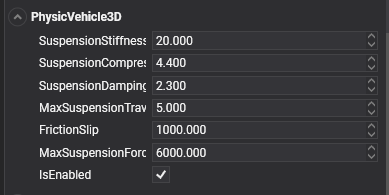
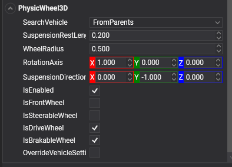

# Vehicle Physics

<video autoplay loop muted width="100%" height="auto">
  <source src="images/physic_vehicle.mp4" type="video/mp4">
</video>

<font size="2">*The car model is based on [Real Car New](https://sketchfab.com/3d-models/real-car-new-d90c7f830f9c41398bb55de4a2e001be) made by Maker Game Studios*</font>

It is possible to simulate physical vehicles using a standard [Rigid Body](rigid_bodies.md) and applying several components to set the vehicle's behavior. This is a simplified vehicle physics model. Instead of simulating each wheel and chassis as separate rigid bodies connected by [joints](../joints/index.md), it uses a simplified model.

The entire vehicle is represented as a single [Rigid Body](rigid_bodies.md), the chassis. The collision detection of the wheels is approximated using [ray-casting](../queries.md#raycast), and the tire friction is modeled using basic anisotropic friction.

To start using physics vehicles in Evergine, we need to use two components:
* **PhysicVehicle3D:** Add this component to the chassis rigid body that we want to turn into a vehicle.
* **PhysicWheel3D:** Add this component to each entity that you want to act as a wheel for the vehicle.  

## PhysicVehicle3D

In Evergine, a vehicle is implemented using the `PhysicVehicle3D` component.



### General Vehicle Properties

| Property | Default | Description |
| --- | --- | --- |
| **SuspensionStiffness** | 20 | Suspension stiffness is a measure of how much force is required to compress the vehicle's suspension. |
| **SuspensionCompression** | 4.4 | This property determines how much the suspension will compress when the wheel hits a bump or obstacle. |
| **SuspensionCompression** | 2.3 | This property determines the rate at which the suspension spring will compress and rebound. It controls the amount of damping force that is applied to the suspension when the vehicle encounters bumps or uneven terrain. |
| **MaxSuspensionTravel** | 5.0 | Represents the maximum distance that the suspension can be compressed or extended. It is measured in units of length. |
| **FrictionSlip** | 1000 | Refers to the amount of slip that occurs between the tire and the ground during motion. Friction slip is typically modeled using a friction coefficient that represents the ratio of the tangential force to the normal force between the tire and the ground. This coefficient can be adjusted to simulate different levels of slip and traction for different types of vehicles and surfaces. |
| **MaxSuspensionForce** | 6000 | Specifies the maximum force that the suspension can apply to the vehicle's chassis. It is used to limit the effect of the suspension when it is compressed or stretched, preventing the vehicle from bouncing too much or losing stability. |

### Control the Vehicle

Using the following methods, you can control your vehicle:

| Method | Description |
| --- | --- |
| **ApplyEngineForce(force)** | This method applies the engine force to the vehicle. This can be adjusted to increase or decrease the vehicle's speed and can be set to a negative value for reverse. *The engine force will be applied only to the drive wheels.* |
| **SetSteeringValue(steering)** | This method sets the vehicle's steering angle. Use this method to change the vehicle's direction. *The steering value is only applied to steerable wheels.* |
| **SetBrake(brake)** | This method indicates the brake force applied by the vehicle. *The brake value is only applied to brakeable wheels.* |

## PhysicWheel3D

In Evergine, a wheel is implemented using the `PhysicWheel3D` component.



### Vehicle Attachment Properties

First, it's necessary to indicate which vehicle entity the wheel will be associated with.

| Property | Default | Description |
| --- | --- | --- |
| **SearchVehicle** | `FromParents` | Indicates the strategy to search for the associated vehicle: <ul><li>**FromParents:** The wheel entity is a child of the Chassis vehicle. Find the first PhysicVehicle3D component in its descendants.</li><li>**FromEntityPath:** The vehicle entity is selected by indicating its [Entity Path](../../basics/component_arch/entities/entity_hierarchy.md#entity-paths).</li></ul> |
| **PhysicVehicleEntityPath** | `null` | Indicates the [Entity Path](../../basics/component_arch/entities/entity_hierarchy.md#entity-paths) of the vehicle entity. |

### Wheel Axis Properties

The following properties help to define the wheel directions for suspension and rotation, among other things. 

| Property | Default | Description |
| --- | --- | --- |
| **WheelRadius** | 0.5 | Determines the wheel radius. The **WheelRadius** value can be used in two ways: <ul><li>If the entity has a mesh (with `MeshComponent`, for example), the size value is relative to the mesh extents.</li><li>If the entity doesn't have any meshes, the size value is used as scene units. |
| **RotationAxis** | 1, 0, 0 | The **RotationAxis** property is used to define the axis around which the wheel rotates. It also indicates the advance direction when applying engine force. *It is specified in the local space of the wheel entity.* |
| **SuspensionDirection** | 0, -1, 0 | Indicates the direction in which the wheel's suspension operates. It also defines the steering wheel direction. *It is specified in the local space of the wheel entity.* |
| **SuspensionRestLength** | 0.2 | Defines the length of the wheel's suspension when the vehicle is in its resting position. |


### Flags Properties

In the following properties, you can specify how the wheel will be used in the car (steerable, brakeable, etc.)

| Property | Default | Description |
| --- | --- | --- |
| **IsFrontWheel** | `false` | Indicates whether this is a front wheel or not. This property, in combination with others, helps to define the wheel's behavior. For example, a steerable wheel that is not a front wheel will be steered in the opposite direction of a front wheel. |
| **IsSteerableWheel** | `false` | If `true`, the wheel will be affected by the vehicle steering values. |
| **IsDriveWheel** | `true` | If `true`, the wheel will be affected by engine force. |
| **IsBrakableWheel** | `true` | Determines if the wheel is able to brake or not. |

With the above properties, you can define different types of vehicles (4x4, front-wheel-drive, etc.).

### Controlling the Wheel Individually

Above we described how to control your vehicle using sets of methods to control the general steering, brake, and engine force values of the vehicle.

You can also avoid using these methods and set these properties individually for each wheel. This allows you to set different values for each wheel (e.g., different steering values per wheel).

| Property | Description |
| --- | --- |
| **Steering** | Indicates the steering angle of this wheel. |
| **EngineForce** | The force applied by the engine to this wheel. |
| **Brake** | The brake force acting on this wheel. |

### Overriding Vehicle Settings

As we mentioned before, the `PhysicVehicle3D` component defines a series of physical properties for the suspension. By default, all of these properties are applied to all wheels equally, but you can override these properties and set your specific values.

| Property | Default | Description |
| --- | --- | --- |
| **OverrideVehicleSettings** | `false` | If `true`, this wheel will ignore the properties defined in the vehicle and will specify its own values. If `false`, the following property values will be ignored. |
| **SuspensionStiffness** | 20 | Suspension stiffness is a measure of how much force is required to compress the vehicle's suspension. |
| **SuspensionCompression** | 4.4 | This property determines how much the suspension will compress when the wheel hits a bump or obstacle. |
| **SuspensionCompression** | 2.3 | This property determines the rate at which the suspension spring will compress and rebound. It controls the amount of damping force that is applied to the suspension when the vehicle encounters bumps or uneven terrain. |
| **MaxSuspensionTravel** | 5.0 | Represents the maximum distance that the suspension can be compressed or extended. It is measured in units of length. |
| **FrictionSlip** | 1000 | Refers to the amount of slip that occurs between the tire and the ground during motion. Friction slip is typically modeled using a friction coefficient that represents the ratio of the tangential force to the normal force between the tire and the ground. This coefficient can be adjusted to simulate different levels of slip and traction for different types of vehicles and surfaces. |
| **MaxSuspensionForce** | 6000 | Specifies the maximum force that the suspension can apply to the vehicle's chassis. It is used to limit the effect of the suspension when it is compressed or stretched, preventing the vehicle from bouncing too much or losing stability. |

## Using Physics Vehicles

In the following snippet, we are going to create a simple vehicle and start controlling it.

### Create the Vehicle

<video autoplay loop muted width="400px" height="auto">
  <source src="images/VehiclePhysicsSample.mp4" type="video/mp4">
</video>

```csharp
protected override void CreateScene()
{
    this.Managers.RenderManager.DebugLines = true;

    // Load your material
    var floorMaterial = this.Managers.AssetSceneManager.Load<Material>(EvergineContent.FloorMat);
    var vehicleMaterial = this.Managers.AssetSceneManager.Load<Material>(DefaultResourcesIDs.DefaultMaterialID);

    // Add a floor
    var floor = new Entity()
        .AddComponent(new Transform3D())
        .AddComponent(new MaterialComponent() { Material = floorMaterial })
        .AddComponent(new PlaneMesh() { Width = 20, Height = 20 })
        .AddComponent(new MeshRenderer())
        .AddComponent(new StaticBody3D())
        .AddComponent(new BoxCollider3D());

    // Create the vehicle entity
    var vehicle = new Entity()
        .AddComponent(new Transform3D() { LocalPosition = new Vector3(0, 2, 0) })
        .AddComponent(new RigidBody3D()
        {
            Mass = 800,  // 800Kg
        })
        .AddComponent(new PhysicVehicle3D());

    // Create the chassis
    var chassis = new Entity()
        .AddComponent(new Transform3D() { LocalScale = new Vector3(1.8f, 1, 3) })
        .AddComponent(new MaterialComponent() { Material = vehicleMaterial })
        .AddComponent(new CubeMesh())
        .AddComponent(new MeshRenderer())
        .AddComponent(new BoxCollider3D());
    vehicle.AddChild(chassis);

    // Add wheels
    vehicle.AddChild(this.AddWheel(vehicleMaterial, new Vector3(1, -0.5f, 1.5f), true, true));
    vehicle.AddChild(this.AddWheel(vehicleMaterial, new Vector3(-1, -0.5f, 1.5f), true, true));
    vehicle.AddChild(this.AddWheel(vehicleMaterial, new Vector3(1, -0.5f, -1.5f), false, false));
    vehicle.AddChild(this.AddWheel(vehicleMaterial, new Vector3(-1, -0.5f, -1.5f), false, false));

    this.Managers.EntityManager.Add(floor);
    this.Managers.EntityManager.Add(vehicle);
}

private Entity AddWheel(Material material, Vector3 position, bool isFront, bool isSteerable)
{
    return new Entity()
        .AddComponent(new Transform3D() 
        { 
            LocalPosition = position, 
            LocalRotation = new Vector3(0, 0, MathHelper.PiOver2) // Rotate the cylinder 90º
        }) 
        .AddComponent(new MaterialComponent() { Material = material })
        .AddComponent(new CylinderMesh() { Height = 0.2f })
        .AddComponent(new MeshRenderer())
        .AddComponent(new PhysicWheel3D()
        {
            IsFrontWheel = isFront,
            IsSteerableWheel = isSteerable,
            RotationAxis = Vector3.UnitY,
            SuspensionDirection = -Vector3.UnitX
        });
}
```

### Control the Car!

We just need to add a simple custom behavior to start controlling the car:

<video autoplay loop muted width="400px" height="auto">
  <source src="images/VehiclePhysicsSample2.mp4" type="video/mp4">
</video>

First of all, create a custom Behavior with the following code:

```csharp
public class VehicleController : Behavior
{
    [BindService]
    private GraphicsContext graphicsContext;

    [BindComponent]
    private PhysicVehicle3D vehicle;

    public float MaxForce = 1000; // Max engine force
    public float Brake = 20;  // Max brake force
    public float MaxSteering = MathHelper.ToRadians(35);
    public float SteeringSmooth = 0.5f;

    private float currentSteering = 0;
    private float steeringVelocity = 0;

    protected override void Update(TimeSpan gameTime)
    {
        var keyboard = this.Managers.RenderManager.ActiveCamera3D.Display.KeyboardDispatcher;

        float engineForce = 0;

        // If W or the Up Arrow key is pressed, move forward...
        if ((keyboard.ReadKeyState(Keys.W) == ButtonState.Pressed) || (keyboard.ReadKeyState(Keys.Up) == ButtonState.Pressed))
        {
            engineForce = MaxForce;
        }
        // If S or the Down Arrow key is pressed, reverse direction...
        else if ((keyboard.ReadKeyState(Keys.S) == ButtonState.Pressed) || (keyboard.ReadKeyState(Keys.Down) == ButtonState.Pressed))
        {
            engineForce = -MaxForce / 3;
        }

        // Apply the brake if the Space bar is pressed
        var brake = keyboard.ReadKeyState(Keys.Space) == ButtonState.Pressed ? Brake : 0;

        // Set the steering value by pressing D, A, or the Left and Right Arrow keys...
        var steeringRotation = 0f;
        if ((keyboard.ReadKeyState(Keys.D) == ButtonState.Pressed) || (keyboard.ReadKeyState(Keys.Right) == ButtonState.Pressed))
        {
            steeringRotation = MaxSteering;

        }
        else if ((keyboard.ReadKeyState(Keys.A) == ButtonState.Pressed) || (keyboard.ReadKeyState(Keys.Left) == ButtonState.Pressed))
        {
            steeringRotation = -MaxSteering;
        }

        // Smooth the steering...
        this.currentSteering = MathHelper.SmoothDamp(this.currentSteering, steeringRotation, ref this.steeringVelocity, this.SteeringSmooth, (float)gameTime.TotalSeconds);

        // Apply the engine force, brake, and steering values...
        this.vehicle.ApplyEngineForce(engineForce);
        this.vehicle.SetSteeringValue(this.currentSteering);
        this.vehicle.SetBrake(brake);
    }
}
```

Later, add this component to the vehicle entity created in the previous section:

```csharp
vehicle.AddComponent(new VehicleController());
```