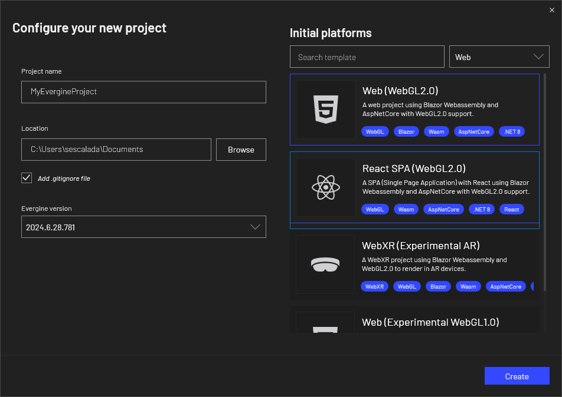
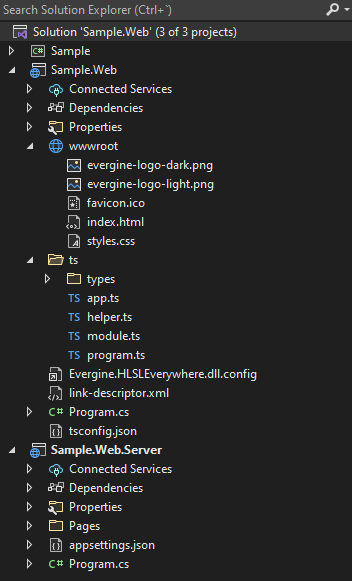
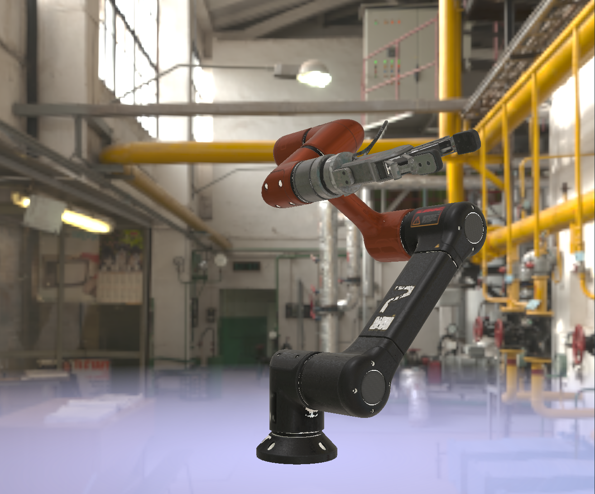

# Getting Started with an Evergine Web Application

---

## Create a New Application

From the Evergine launcher, you can create a Web (WebGL 2.0) project or add the web profile from the Evergine Studio.



Evergine now offers two web templates: an HTML5 web template and a ReactJS web template. Both options are designed to execute Evergine in a web canvas, allowing for flexibility in your web development approach.

This template adds two projects to the web solution: the _Web_ project, which is the web application client that uses TypeScript to execute Evergine in a web canvas, and an optional _Server_ project, which is an ASP server application that implements some optimizations for asset loading that can only be done from the server side.



After editing your scene in Evergine Studio as usual, run the _Web.Server_ project or the _Web_ project from Visual Studio 2022 to see it running in the browser.



For the ReactJS template, the web solution includes a different set of projects: the Host project (equivalent to the Server project in the HTML5 template), the WebReact project (similar to the Web project), and an additional react.spa project, which holds the code for the single-page application (SPA).


Finally, check out [how to deploy the app](ops.md) and [improve its performance](tips.md).

### ReactJS Web Template

The ReactJS template for Evergine uses the **evergine-react** NPM package, which is registered on [npmjs.com/package/evergine-react](https://www.npmjs.com/package/evergine-react). This package contains a set of helper components designed to facilitate interaction with Evergine within a ReactJS single-page application (SPA).

The main component provided by this package is the _EvergineCanvas_, which is used in the _App.tsx_ file. This component renders the HTML5 canvas where Evergine will be executed. Another important file is _evergine-initialize.ts_, which is responsible for managing communication between the SPA and Evergine via a WebAssembly (WASM) JavaScript bridge.

The **evergine-react** package also includes a state store for Evergine, which holds two key values:

- **webAssemblyLoaded**: Becomes **true** once WASM has been successfully loaded.
- **evergineReady**: Becomes **true** once Evergine has initialized all necessary assets.

It’s recommended to wait for both of these values to be **true** before initiating any custom communication between the SPA and Evergine. This helps prevent potential race conditions that could occur if communication is attempted too early.

For example, following code snippet modifies the _App.tsx_ file to include a text message that will be displayed while Evergine is loading.

```typescript
import './App.css';
import { useEvergineStore, EvergineCanvas } from "evergine-react";
import { EVERGINE_CANVAS_ID } from "evergine/config";
import { useWindowSize } from "evergine/useWindowSize";

function App() {
    const { webAssemblyLoaded, evergineReady } = useEvergineStore();

    return (
        <div className="App">
            {(!webAssemblyLoaded || !evergineReady) && (<div>Loading Evergine...</div>)}
            <EvergineCanvas
                canvasId={EVERGINE_CANVAS_ID}
                width={useWindowSize().width}
                height={useWindowSize().height}
            />
        </div>
    );
}

export default App;
```

When you build the SPA (react.spa) project, all required code and dependencies will be copied into the **public** folder. This folder contains the SPA code that embeds the Evergine canvas and can be deployed as a static website.


### Invoking Functions Between SPA and Evergine

In Evergine, communication between the single-page application (SPA) and the engine is facilitated through function invocations in both directions: from the SPA to Evergine and from Evergine to the SPA. This process enables dynamic interactions, such as triggering engine events from the UI or responding to engine updates in real-time.

In the following steps, we will demonstrate how to set up these function invocations, starting with calls from the SPA to Evergine and then covering calls from Evergine back to the SPA. Each step is accompanied by code examples to illustrate the process.

#### Step 1: Adding a Custom Scene Manager for Communication

To handle communication between the SPA and Evergine, we first need to add a custom scene manager. This manager will serve as the central point for invoking functions from the SPA to Evergine and for receiving callbacks from Evergine back to the SPA.

In this example, we will define a callback class that must be implemented in the WebReact project. In WebFacade class will include methods to handle two-way communication: sending messages from the SPA to Evergine and receiving messages back from Evergine to the SPA.

The following code snippet demonstrates how to create the custom scene manager and the callback class:

```csharp
public class MySceneManager : SceneManager
{
    public EvergineCallbacks Callbacks { get; set; }

    public void MessageToEvergine(string message)
    {
        Console.WriteLine(message);
        _ = Task.Run(async () =>
        {
            await Task.Delay(2000);
            this.Callbacks?.MessageFromEvergine("Hello from Evergine!");
        });
    }

    public abstract class EvergineCallbacks
    {
        public abstract void MessageFromEvergine(string message);
    }
}
```

Once we've defined the custom scene manager, we need to register it within the _MyScene_.

```csharp
public class MyScene : Scene
{
    public override void RegisterManagers()
    {
        base.RegisterManagers();
        
        this.Managers.AddManager(new global::Evergine.Bullet.BulletPhysicManager3D());
        this.Managers.AddManager(new MySceneManager());
    }

    protected override void CreateScene()
    {
    }
}
```

#### Step 2: Extend _WebFacade_ in web project

Next, we’ll extend the WebFacade to add new communication methods that can invoke functions between the SPA and Evergine. This is where we define how the SPA will communicate with the scene manager and vice versa.

_WebFacade.cs_

```csharp
public static class WebFacade
{        
    private const string BaseInvokeClassName = "Sample.WebReact.WebFacade";

    private static MySceneManager sceneManager;

    public static MySceneManager SceneManager
    {
        get => sceneManager;
        set
        {
            sceneManager = value;
            sceneManager.Callbacks = new WebCallbacks();
        }
    }

    // ...
    [JSInvokable($"{BaseInvokeClassName}:MessageToEvergine")]
    public static void MessageToEvergine(string message) => SceneManager?.MessageToEvergine(message);

    private class WebCallbacks : EvergineCallbacks
    {
        public override void MessageFromEvergine(string message)
        {
            Program.Wasm.Invoke("App.appEventsListener.onMessageFromEvergine", args: message);
        }
    }
}
```

_Program.cs_
```csharp
private static void ScreenContextManager_OnActivatingScene(Scene scene)
{
    var sceneManager = scene.Managers.FindManager<MySceneManager>();
    WebFacade.SceneManager = sceneManager;

    Wasm.Invoke("App.appEventsListener.onEvergineReady", false, true);
}

private static void ScreenContextManager_OnDesactivatingScene(Scene scene)
{
    WebFacade.SceneManager = null;
    Wasm.Invoke("App.appEventsListener.onEvergineReady", false, false);
}
```

#### Step 3: Adding Invokes and Callbacks in _evergine-initialize.ts_

To complete the communication setup between the SPA and Evergine, we will modify the _evergine-initialize.ts_ file. In this step, we’ll extend the AppEventsListener to handle invokes coming from Evergine, and we’ll extend WebEventsProxy to define methods that the SPA can use to send messages to Evergine.

```typescript
import { initializeEvergineBase } from "evergine-react";

import {
  EVERGINE_ASSEMBLY_NAME,
  EVERGINE_CLASS_NAME,
  EVERGINE_LOADING_BAR_ID,
} from "evergine/config";

declare global {
  let Blazor: { start(): Promise<void> };  

  interface AppEventsListener {
    onMessageFromEvergine: (message: string) => void
  }
  interface WebEventsProxy {
    sendMessageToEvergine: (message: string) => void;
  }
}

function addCustomEvents() {
    window.App.appEventsListener.onMessageFromEvergine = (message: string): void =>
        console.log(message);
    window.App.webEventsProxy.sendMessageToEvergine = (message: string): void =>
        window.Utils.invoke("MessageToEvergine", message);
}

const initializeEvergine = (): void => {
  initializeEvergineBase(
    EVERGINE_LOADING_BAR_ID,
    EVERGINE_ASSEMBLY_NAME,
    EVERGINE_CLASS_NAME,
    addCustomEvents
  );
};

export { initializeEvergine };
```

With this setup in place, you can test the communication by invoking the method directly from the browser’s development console. For example, to send a message from the SPA to Evergine, you can call the following in the console:

```javascript
App.webEventsProxy.sendMessageToEvergine("Hello from SPA!")
```
This will trigger the sendMessageToEvergine method. After two seconds, a message saying "Hello from Evergine!" will be sent back to the SPA and displayed in the console.

```
Hello from Evergine!
```

This is only one possible approach to setting up communication between the SPA and Evergine. You are free to define your own method for handling this interaction based on your specific requirements.