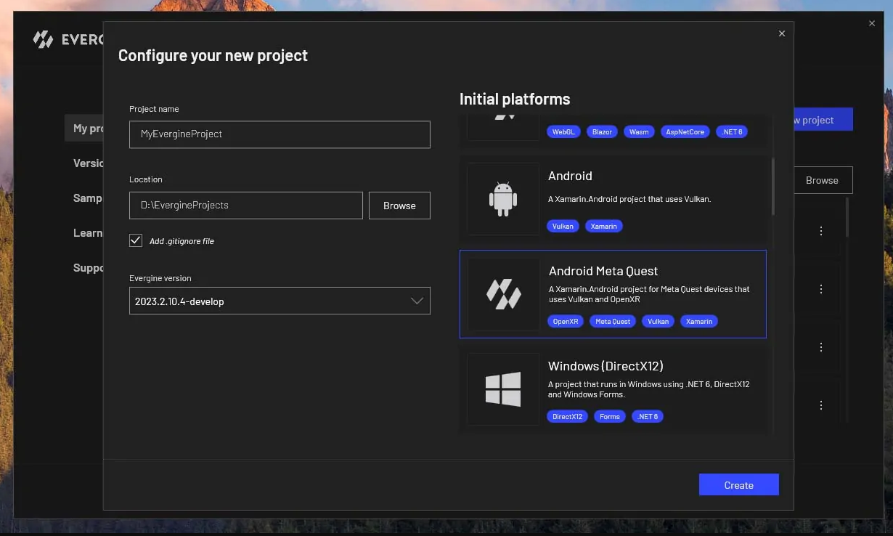
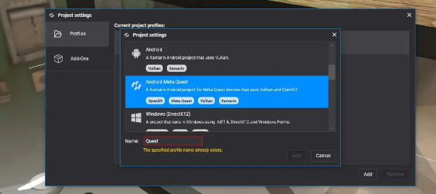

# Meta Quest

The Oculus Quest device is now called Meta Quest following the latest announcement from Facebook. This is the most popular VR headset currently, with about 10 million units of the newest Quest 2 device sold.

Thanks to the OpenXR standard, the latest version of Evergine allows you to deploy your VR applications on Meta Quest devices.

For maximum performance and to support future graphics features, we use Vulkan as the only Graphics API on this Android-based platform.

## Create a Meta Quest Template

To start developing your Evergine project with Meta Quest, simply select the Android Meta Quest template when creating an Evergine project:

Alternatively, if you have already created an Evergine project, you can add the Meta Quest profile in the Project Settings:

## Meta Quest optional extensions

Evergine supports the following Meta Quest extensions for OpenXR, and you need to take some actions in order to enable these extensions.

### Passthrough

To enable Passthrough on Meta Quest devices with Evergine, starting with the Evergine Quest profile, you need to:

- **Enable OpenXR Passthrough Extensions.** In the `MainActivity.cs` file, uncomment the following extensions in the OpenXRPlatform constructor: `XR_FB_passthrough` and `XR_FB_triangle_mesh` (the latter is necessary if you want to project passthrough onto custom meshes).

- **Enable the Passthrough feature** in the `AndroidManifest.xml` file by uncommenting the relevant profile.

### Use Simultaneous Hands and Controllers (Multimodal)

Multimodal input provides simultaneous tracking of both hands and controllers. It also indicates whether the controller(s) are in hand or not. Multimodal input allows users to enjoy the benefits of both worlds: they can use hands for immersion, and controllers for accuracy and haptics.

Check [here](https://developers.meta.com/horizon/documentation/native/android/native-multimodal/?locale=fi_FI) for more information.

To enable this feature on Meta Quest devices with Evergine, starting with the Evergine Quest profile, you need to:

- **Enable OpenXR Extensions.** In the `MainActivity.cs` file, uncomment the following extensions in the OpenXRPlatform constructor: `XR_META_simultaneous_hands_and_controllers`.

- **Enable the feature** in the `MainActivity.cs` file, set the `UseSimultaneousHandsAndControllers` property to `true`. This property can be enabled or disabled during runtime.

