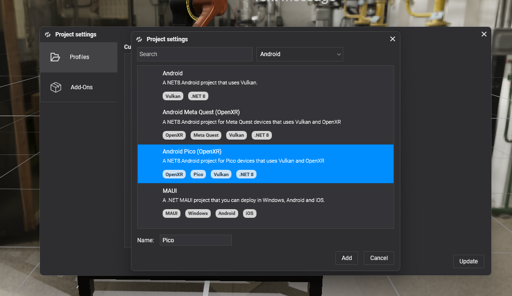

# Pico VR

**Pico VR** headsets, like Pico 4, are powerful standalone devices designed for immersive VR experiences. 

# Create a Pico VR Template

To start developing your Evergine project with Pico VR, select the Android Pico VR template when creating a new Evergine project:

If you already have an Evergine project, you can add the Pico VR profile directly from the Project Settings:

