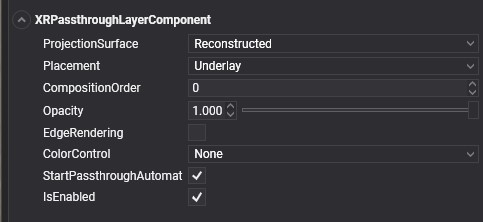

# XR Passthrough

<video autoplay loop muted width="100%" height="auto">
  <source src="images/xrpassthrough.mp4" type="video/mp4">
</video>

**Passthrough** provides a real-time, immersive 3D visualization of the physical world through XR headsets. The Passthrough API allows developers to seamlessly integrate this view into their virtual experiences.

## Supported Devices

Evergine currently supports **Passthrough** on the following devices:

| Device | XR Platform |
| --- | --- |
| **Meta Quest X** | **OpenXR**. Learn more [here](https://developers.meta.com/horizon/documentation/native/android/mobile-passthrough). |

## How Does It Work?

Passthrough is rendered by a dedicated service in a separate layer, which is directly submitted to the XR Compositor. Applications cannot access the user's physical environment images or videos. Instead, they submit a placeholder layer that the XR Compositor replaces with the actual passthrough. Passthrough customization is possible through composite layering and styling:

- **Composite layering** allows you to define the placement of the passthrough layer relative to virtual content (either overlay or underlay) in the XR Compositor stack. You can also control how it blends with the virtual environment. Using alpha masking, you can specify which areas of the screen show passthrough. Currently, depth-based blending is not supported.
- **Styling** enables you to colorize the passthrough feed and apply visual effects, such as edge rendering.
- **Surface-Projected Passthrough** lets you specify the geometry onto which passthrough images are projected. This method offers more stable rendering, especially when certain parts of the user's environment are known to the application.

## Prerequisites

Before using passthrough, ensure your device is running the latest operating system.

### Prerequisites for Meta Quest Devices

To enable Passthrough on Meta Quest devices with Evergine, starting with the Evergine Quest profile, you need to:

- **Enable OpenXR Passthrough Extensions.** In the `MainActivity.cs` file, uncomment the following extensions in the OpenXRPlatform constructor: `XR_FB_passthrough` and `XR_FB_triangle_mesh` (the latter is necessary if you want to project passthrough onto custom meshes).


- **Enable the Passthrough feature** in the `AndroidManifest.xml` file by uncommenting the relevant profile.


## XRPassthroughLayer Component

To use Passthrough layers in your application, create an Entity and add the `XRPassthroughLayerComponent`:



This component enables and configures the Passthrough layer properties.

### Layer Properties

These settings configure the Passthrough layer's behavior, including order, projection, and other details.

There are two types of passthrough surfaces:

- **Automatically Reconstructed (Default):** By default, the Passthrough API automatically creates and submits this layer to the XR Compositor using environment reconstruction. This is the most common method, as the user’s environment geometry is usually unknown beforehand.<br/><video autoplay loop muted width="250px" height="auto"><source src="images/xrpassthroughreconstructed.mp4" type="video/mp4"></video>

- **Surface-Projected Passthrough (User Defined):** This option allows applications to define the geometry onto which passthrough images are projected, rather than relying on automatic depth reconstruction. Passthrough will only appear within the defined surface geometries, and the rest of the layer will remain transparent. To use this:
  - Add the `XRPassthroughLayerComponent` to an Entity with a `MeshComponent`, which will project the passthrough.
  - Add the `XRPassthroughSurfaceMeshComponent` to indicate that the mesh of this entity will be used for the passthrough projection.<br/><video autoplay loop muted width="250px" height="auto"><source src="images/xrpassthroughuserdefined.mp4" type="video/mp4"></video>

| Property | Description |
| --- | --- |
| **ProjectionSurface** (Default: Reconstructed) | Defines the surface onto which passthrough textures are projected: <ul><li>**Reconstructed:** Uses automatic environment reconstruction.</li><li>**UserDefined:** Allows applications to specify the projection geometry.</li></ul> |
| **Placement** (Default: Underlay) | Determines layer placement: <ul><li>**Underlay:** Renders passthrough beneath the Evergine scene.</li><li>**Overlay:** Renders passthrough on top of the Evergine scene.</li></ul> |
| **CompositionOrder** (Default: 0) | For applications with multiple layers, this defines the rendering order. |

 > [!Note]
> If you wish to use a Passthrough layer as a background (`Underlay`), set the Camera's `BackgroundColor` to `Transparent` and disable or remove any background-rendering entities (e.g., Sky Atmosphere). Otherwise, the Evergine scene will obscure the Passthrough layer.

### Layer Style Properties

These properties define how the passthrough surfaces are rendered and styled:


| Property | Description |
| --- | --- |
| **Opacity** (Default: 1) | Adjusts the passthrough image opacity, independent of edge rendering. |
| **EdgeRendering** (Default: false) | Enables an edge detection algorithm, superimposing detected edges on the passthrough image. |
| **EdgeColor** (Default: White) | Sets the color for edge detection, available only when `EdgeRendering` is enabled. |
| **ColorControl** (Default: None) | Adjusts the passthrough image’s color. Options include: <ul><li>**None:** No color modification.</li><li>**ColorAdjustment:** Adjusts brightness, contrast, and saturation (saturation is effective only on devices supporting color passthrough).</li><li>**ColorMap:** Converts the passthrough image to grayscale (if applicable) and maps each value to an RGBA value using a lookup table.</li><li>**GrayscaleMap:** Converts the passthrough image to grayscale and remaps values based on a lookup table.</li></ul> |

##### EdgeRendering Properties
These settings apply only when `EdgeRendering` is enabled.

| Property | Description |
| --- | --- |
| **EdgeColor** (Default: White) | Sets the color for edge detection. |

<video autoplay loop muted width="250px" height="auto"><source src="images/xrpassthrough_edgerendering.mp4" type="video/mp4"></video>

#### ColorAdjustment Properties
These settings apply when `ColorControl` is set to `ColorAdjustment`. Adjust brightness, contrast, and saturation of the passthrough image.

| Property | Description |
| --- | --- |
| **Brightness** (Default: 0) | Brightness adjustment in the range [-100, 100]. The neutral value is 0. |
| **Contrast** (Default: 1) | Contrast adjustment in the range [0, Infinity]. The neutral value is 1. |
| **Saturation** (Default: 1) | Saturation adjustment in the range [0, Infinity]. The neutral value is 1. |

#### ColorMap Properties
These settings apply when `ColorControl` is set to `ColorMap`. Convert passthrough images to grayscale (if applicable) and remap values using an RGBA lookup table.

| Property | Description |
| --- | --- |
| **ColorMapMonoToRGBA** (Default: `null`) | A `ColorCurve` instance. Specify keyframes in the [0, 1] range, assigning a color to each key. *See example below.* |

```csharp
// Create a color curve map
ColorCurve colorMap = new ColorCurve();
colorMap.Keyframes.Clear();
colorMap.AddKey(0, Color.Black);
colorMap.AddKey(0.1f, Color.Blue);
colorMap.AddKey(0.4f, Color.Green);
colorMap.AddKey(0.6f, Color.Red);
colorMap.AddKey(0.8f, Color.Yellow);
colorMap.AddKey(1, Color.White);

// Assign to the Passthrough layer component
passthroughLayer.ColorMapMonoToRGBA = colorMap;
```
<video autoplay loop muted width="250px" height="auto"><source src="images/xrpassthrough_colormap.mp4" type="video/mp4"></video>

#### GrayscaleMap Properties
These settings apply when `ColorControl` is set to `GrayscaleMap`. Convert passthrough images to grayscale (if applicable) and remap values using a lookup table.

| Property | Description |
| --- | --- |
| **ColorMapMonoToMono** (Default: `null`) | A `FloatCurve` instance. Specify keyframes in the [0, 1] range, assigning a float value to each key. *See example below.* |

```csharp            
// Create a curve map to invert grayscale colors
FloatCurve monoMap = new FloatCurve();
monoMap.Keyframes.Clear();
monoMap.AddKey(0, 1);
monoMap.AddKey(1, 0);

// Assign to the Passthrough layer component
passthroughLayer.ColorMapMonoToMono = monoMap.


```

<video autoplay loop muted width="250px" height="auto"><source src="images/xrpassthrough_monomap.mp4" type="video/mp4"></video>