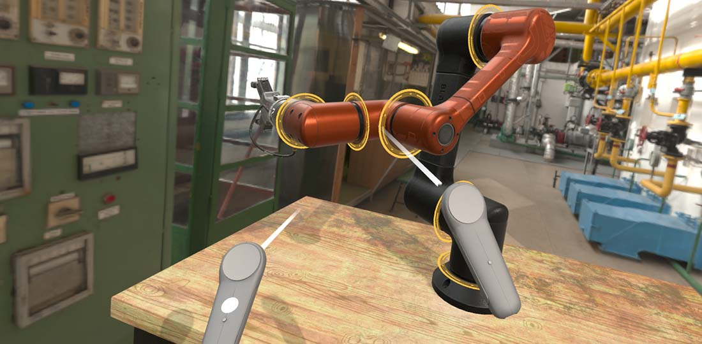

# XR Platform

**XRPlatform** is the main service in Evergine to provide XR functionality to your applications. This service, through its implementations, is responsible for:
- Creating and maintaining the XR session.
- Creating and maintaining all required graphic resources to properly render the scene in the XR environment.
- Updating the scene Camera to track the HMD device.
- Offering access to different XR subsystems (such as Input Tracking, Spatial Mapping, etc.).



> [!Note]
> It is possible (and common) that some XRPlatform providers do not implement all functionalities exposed by this service. For example, the SteamVR implementation (Evergine.OpenVR extension) doesn't provide Spatial Mapping functionality or Hand Tracking.

## Camera3D and HMD Tracking

One of the main purposes of an XR platform is to track the head position and properly set up the render output to be displayed on the HMD device.

With Evergine.XR, using XRPlatform, you don't need to create special Components or instantiate XR Camera prefabs.

You only need to create a common [Camera 3D](../graphics/cameras.md) for your scene, and XRPlatform will update its properties every frame to match the HMD device properties. This approach has many advantages, one of which is that you can develop your application with or without XR integration without any changes to your scene.

XRPlatform sets the following Camera properties:
* **Camera Position & Orientation:** Updates with the HMD device pose, including its position and orientation.
* **Camera Projection:** The Camera Projection properties are changed to match the projection required by the device.

If you register the XRPlatform display as the default Display, the Camera will render directly to the HMD device display.

## Important Properties

You can access useful information about the current XR session using the following properties:

### General Properties

| Property | Description |
|---|---|
| **Display** | Returns the display that will be configured to render in the XR device. To render your scene, you need to set up your camera to render in that Display. This is done by default if you register the XR Display as the DefaultDisplay. |
| **MirrorDisplay** | This display will be used to mirror the content that is rendering in the XR device. Additionally, it is also used to provide access to [Input dispatchers](../input/index.md) in your application. |
| **RenderMirrorTexture** | Boolean that indicates if you want to mirror the XR content into the Mirror Display. | 
| **MSAASampleCount** | Sets up the XR platform to create graphics resources using the specified MSAA Sample Count. This helps to increase object definition and sharpness but can reduce the application's performance. |

### HMD Properties

You can access properties regarding the HMD device:

| Property | Description |
|---|---|
| **TrackingState** | Gets the current device tracking state. It can indicate several tracking statuses, such as everything being okay, or on the contrary, the device not being initialized or being out of range. |
| **HeadGaze** | Ray that points from the head position to the direction the device is facing. |
| **EyeCount** | Number of eyes that this device will render. In most common XR applications, the number is 2. |

### Eye Gaze

Some XR devices have the capability to track the eye look direction (HoloLens2, for instance). In such cases:

| Property | Description |
|---|---|
| **EyeGaze** | Gets a ray that indicates the position and direction that the user is looking with their eyes. |
| **IsEyeGazeValid** | Boolean that indicates if the eye gaze is providing valid values. This can be false if the eye is not well-tracked, or if the device doesn't support this feature or doesn't have permission to track eyes. |
| **RequestEyeGazePermission()** | Async method that requests the device to grant permission to track the user's eyes. It will return true only if the device supports eye gazing and the user has approved this interaction (in most devices, it usually shows a small dialog requesting this permission). |

A small example of how to use eye gazing in your application:

```csharp
        protected override bool OnAttached()
        {
            if (base.OnAttached())
            {
                // Request eye gaze permission...
                this.RequestPermission();
                return true;
            }

            return false;
        }

        protected override void Update(TimeSpan gameTime)
        {
            if (this.xrPlatform.IsEyeGazeValid)
            {
                var eyeGaze = this.xrPlatform.EyeGaze.Value;

                // modify the transform to follow the eye gaze...
                this.transform.LocalPosition = eyeGaze.Position;
                this.transform.LookAt(eyeGaze.GetPoint(1));
            }
        }        

        private async void RequestPermission()
        {
            await this.xrPlatform.RequestEyeGazePermission();
        }
```

## XR Subsystems

XRPlatforms allow you to access more functionality beyond what has been described above. The following documents will cover these areas:

- **[Input Tracking](input_tracking/index.md)**
- **[Spatial Mapping](spatial_mapping.md)**
- **[Spatial Anchors](spatial_anchors.md)**